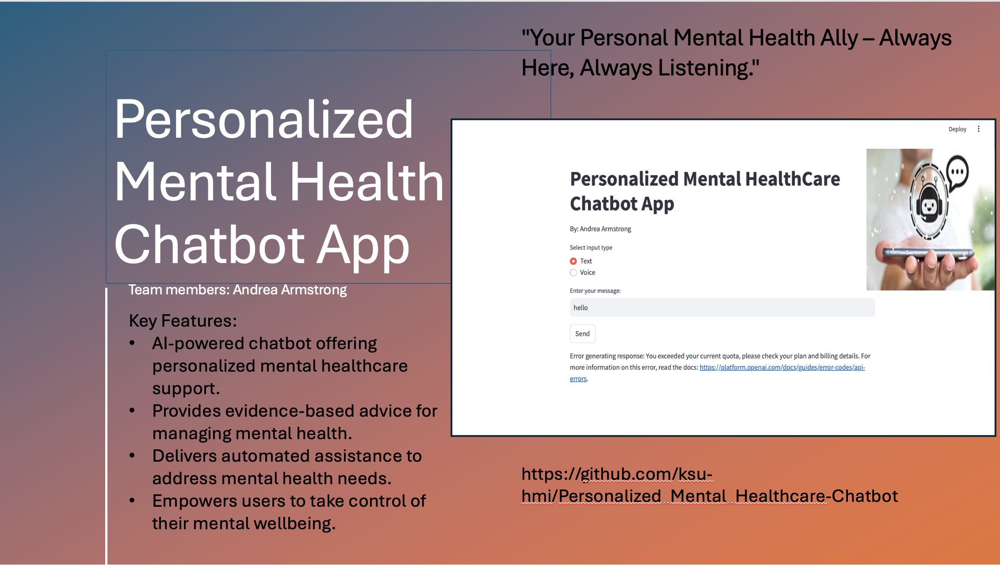

# Personalized_Mental_Healthcare-Chatbot
The app is an AI-powered chatbot that offers personalized mental healthcare support to users, provides personalized responses to user queries related to mental health, emotional well-being, and self-care. Helping them to manage health It provides automated assistance and empowers users to take control of their mental wellbeing.
Run Personalized_Mental_Healthcare-Chatbot.py file with AI_MENTAL_HEALTH.csv dataset for checking chatbot.
Install the required packages by running the following command in your terminal: "pip install -r requirements.txt". This will install all the necessary Python libraries, including streamlit, openai, pandas & speech_recognition.

